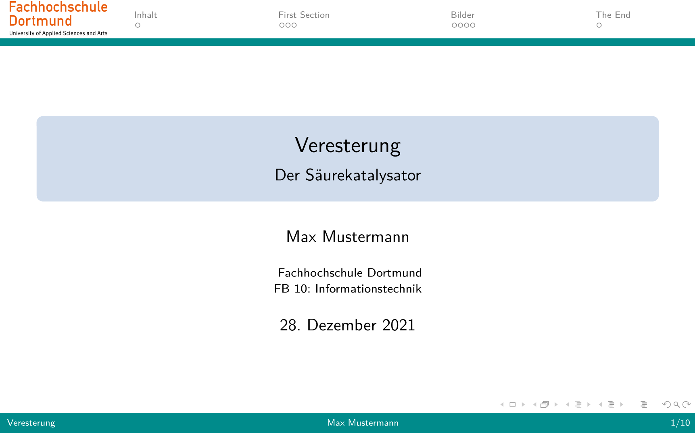
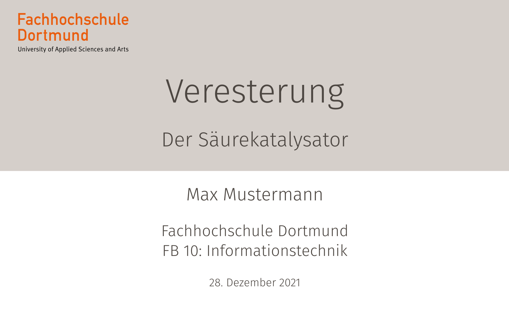
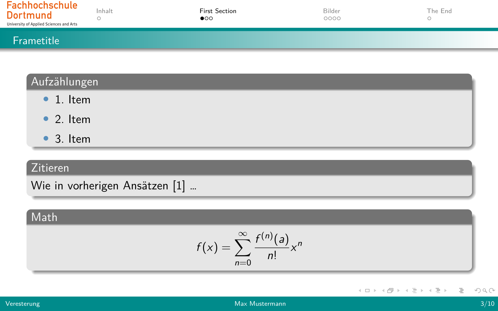
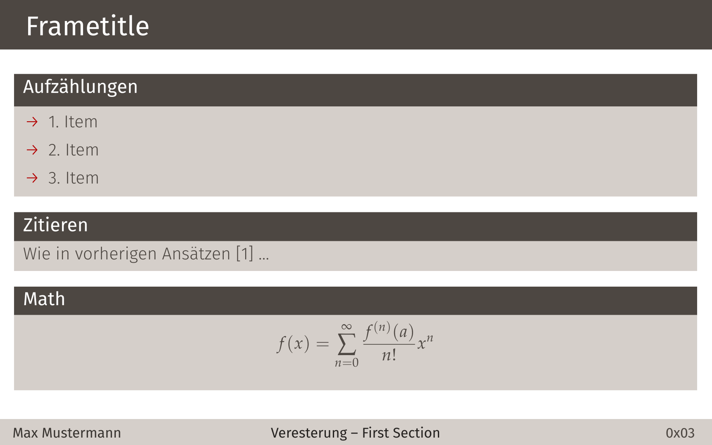
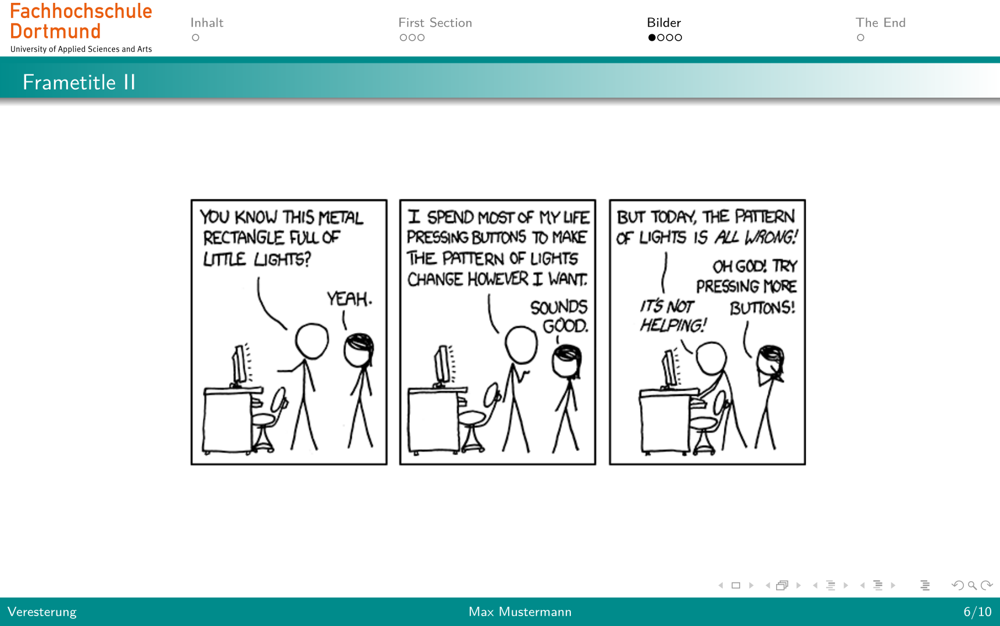
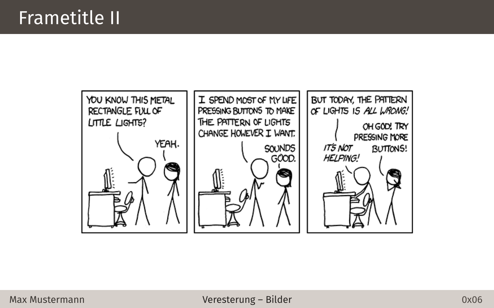

# FH-DO Beamer Themes
This repository provides two Beamer Templates [FH-DO green](slides_green.pdf) & 
[FH-DO vertex](slides_vertex.pdf) for you. Feel free to use, contribute or automate.

|FH-DO green|FH-DO vertex|
|-----------|------------|
|||
|||
|||

# Installation
Make sure TeX Live (LaTeX, lualatex) and make is installed on your system, if not hit:

|    package manager | installation |
|--------------------|--------------|
|rpm   |``sudo dnf install texlive make`` |
|dpkg     |``sudo apt-get install texlive make``|
|pacman  |``sudo pacman -S texlive make``|

Clone the the repo:

``git clone https://github.com/Timgrau/FHDO-Beamer-Theme.git ``

navigate into the folder and hit ``make``, this will produce a directory ``/output`` where you will find the produced files 
 (``slides.pdf``. ``slides.aux``, etc.).

# Change themes
If you want to change the themes open ``slides.tex`` and change (line. 12 ff.) by choosing:
1. ```\usetheme[totalframes]{green}```
2. ```\usetheme[totalframes]{vertex}```
3. ```\usetheme[simplefootline]{vertex}```
4. ```\usetheme[dark, hexcount, totalframes]{vertex}```

Both themes can count binary or hexadecimal pages if you want to, provided by lua-scripts:
- binary page number: ```\usetheme[bincount]{<theme>}```
- hexadecimal page number ```\usetheme[hexcount]{<theme>}```
- decimal page number ```\usetheme[]{<theme>}```
